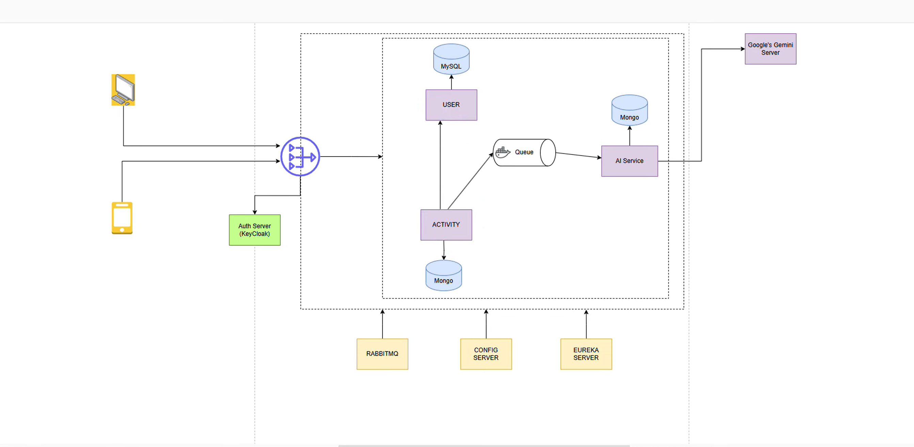

# AI Fitness App

Welcome to the **AI Fitness App** — an intelligent, microservice-driven health companion that helps users track their fitness activities and leverages AI to provide personalized insights!

---

## Features

- **User Registration & Management** with secure authentication using Keycloak.
- **Activity Tracking** via RESTful endpoints.
- **Event-driven architecture** powered by RabbitMQ for real-time updates.
- **AI Recommendation Engine** integrated with Google Gemini for fitness insights.
- **Secure API Gateway** for authenticated & authorized access.
- **Service Discovery & Configuration** using Eureka & Config Server.
- **Polyglot Persistence** using MySQL & MongoDB.
- Scalable Microservices built with **Spring Boot**.

---

## Architecture

Here's a high-level overview of the system architecture:

---

## Tech Stack

| Layer       | Technology                  |
|-------------|-----------------------------|
| Frontend    | Not included in this repo   |
| Backend     | Spring Boot (Java)          |
| API Gateway | Spring Cloud Gateway        |
| Authentication | Keycloak                    |
| Messaging Queue | RabbitMQ                    |
| Discovery   | Eureka Server               |
| Config      | Spring Cloud Config Server  |
| Databases  | MySQL (User), MongoDB (Activity, AI) |
| AI Integration | Google Gemini API           |

---

## Microservices Overview

### 1. `user-service`
- Handles user registration and profile management
- Uses MySQL for persistence

### 2. `activity-service`
- Manages user fitness activities
- Stores data in MongoDB
- Publishes messages to RabbitMQ

### 3. `ai-service`
- Consumes activity data from RabbitMQ
- Uses Google Gemini for generating fitness insights
- Stores results in MongoDB

### 4. `api-gateway`
- Routes incoming requests to respective microservices
- Secured with Keycloak

### 5. `config-server`
- Centralized configuration for all services

### 6. `eureka-server`
- Service registry and discovery for microservices

---

## Setup & Run Locally

### Prerequisites

- Java 17+
- Maven
- Docker & Docker Compose
- RabbitMQ
- MySQL & MongoDB
- Keycloak

### Testing with Postman

All services are Postman-tested and running as expected. You can import the [Postman collection](postman/AI-Fitness-Collection.json) to explore endpoints.

---

## Security Considerations

- `application.yml` is excluded from version control via `.gitignore` to protect secrets like DB credentials.
- Secrets and credentials are managed via Spring Config Server and environment variables.

---

